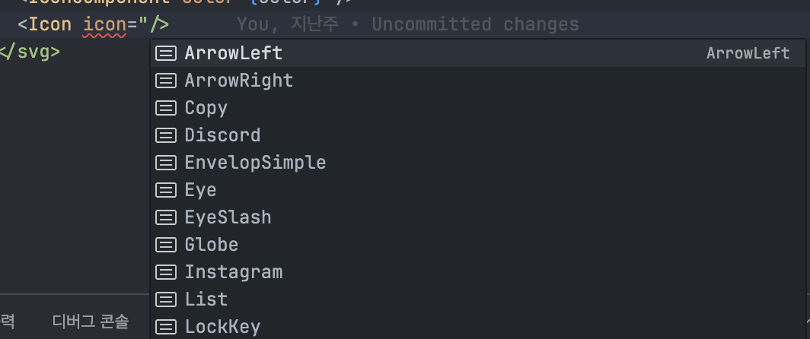

# 05. 타입 활용하기
### ✨ 키워드

- 조건부 타입
- infer
- 템플릿 리터럴
- 불변 객체 타입

## 5.1 조건부 타입

### 조건부 타입이란 ?

> 조건에 따라 출력 타입을 다르게 도출할 수 있음
> 

example

```tsx
type A = condition ? number : string
```

효과

- 중복되는 타입 코드를 제거
- 상황에 따라 적절한 타입을 얻을 수 있음

### 학습목표

<aside>
💡

1. extends, infer, never 등을 활용해 원하는 타입을 만들어보며 어떤 상황에서 조건부 타입이 필요한지 알아보자.
2. 조건부 타입을 적용했을 때 어떤 장점을 얻을 수 있는지 알아보자.
</aside>

### 1. extends와 제네릭을 활용한 조건부 타입

extends 키워드

```tsx
// 타입 확장
interface Animal {
    category: string;
}

interface Dog extends Animal {
    name: string;
}

const dog: Dog = {
    category: 'Mammal',
    name: 'Buddy',
}

// 한정자
function logAnimal<T extends { name: string }>(animal: T): void {
  console.log(`Animal's name is: ${animal.name}`);
}

const dog = { name: 'Buddy', age: 3 };
logAnimal(dog); // Animal's name is: Buddy

const cat = { age: 2 };
// logAnimal(cat); // ❌ 오류: '{ age: number }' 타입에 'name' 속성이 없습니다.
```

extends를 활용한 조건부 타입

```tsx
T extends U ? X : Y
```

```tsx
interface Bank {
	financialCode: string;
	companyName: sttring;
	name: string;
	fullName: string; // Bank의 고유 프로퍼티
}

interface Card {
	financialCode: string;
	companyName: string;
	name: string;
	appCardType?: string; // Card의 고유 프로퍼티
}

type PayMethod<T> = T extends "card" : Card : Bank // 조건부 타입을 사용하기
type CardPayMethod = PayMethod<"card">
type BackPayMethod = PayMethod<"bank">
```

만약 이렇게 조건부 타입을 사용하지 않는다면 어떠한 문제점이 발생할까 ?

구현사항

- 계좌 정보 API: /baeminpay/…/bank
- 카드 정보 API: /baeminpay/…/card
- 앱 카드 정보 API: /baeminpay/…/appcard

```tsx
// 프론트에서 관리하는 결제 수단 관련 데이터로 UI를 구현하는 데 사용되는 타입
interface PayMethodInterface = {
	companyName: string;
}

// 서버에서 받아오는 결제 수단 기본 타입, 은행과 카드에 모두 들어있음
interface PayMethodBaseFormRes {
	financialCode: string;
	name: string;
}

interface Bank extends PayMethodBaseFormRes {
	fullName: string;
}

interface Card extends PayMethodBaseFormRes {
	appCardType?: string;
}

// 최종적인 은행, 카드 결제 수단 타입
// 프론트에서 추가되는 UI 데이터 타입과 제네릭으로 받아오는 Bank 또는 Card를합성
// extends를 한정자로 사용하여 Bank 또는 Card를 포함하지 않는 타입은 제네릭으로 사용할 수 없음.
type PayMethodInfo<T extends Bank | Card> = T & PayMethodInterface
```

```tsx
type PayMethodType = PayMethodInfo<Card> | PayMethodInfo<Bank>
export const useGetRegisteredList = (
	type: 'card' | 'appcard'| 'bank'
): UseQueryResult<PayMethodType[]> => {
	const url = `baeminpay/codes/${type === 'appcard' ? 'card' : 'bank'}`
	
	const fetcher = fetcherFactory<PayMethodType[]>({
		onSuccess: (res) => {
			const unsablePocketList = res?.filter(
				(pocket: PocketInfo<Card> | PocketInfo<Bank>) => pocket?.useType === 'USE'
			) ?? []
			
			return unsablePocketList
		}
	})
	
	const result = useCommonQuery<PayMethodType[]>(url, undefined, fetcher)
	
	return result
}

// component
const MyComponent = () => {
	const { data: pocketList } = useGetRegisteredList("card")
	
	// return something
}
```

- 💡 Question. pocketList는 어떤 타입일까 ? PayMethodInfo<Card> | PayMethodInfo<Bank>
    
    ✨ 유니온으로 되어있기 때문에 알 수 없음
    

extends 조건부 타입을 활용해서 이 문제를 개선해보자.

solution )

1. 타입 가드 사용하기
2. 조건부 타입 사용하기

개선 사항

appcard 또는 card → PayMethodInfo<Card>

bank → PayMethodInfo<Bank>

```tsx
type PayMethodType<T extends "card" | "appcard" | "bank"> = T extends
	| "card"
	| "appcard"
	? Card
	: Bank
```

```tsx
export const useGetRegisteredList = <T extends "card" | "appcard" | "bank">(
	type: T
): UseQueryResult<PayMethodType<T>[]> => {
	const url = `baeminpay/codes/${type === 'appcard' ? 'card' : 'bank'}`
	
	const fetcher = fetcherFactory<PayMethodType<T>[]>({
		onSuccess: (res) => {
			const unsablePocketList = res?.filter(
				(pocket: PocketInfo<Card> | PocketInfo<Bank>) => pocket?.useType === 'USE'
			) ?? []
			
			return unsablePocketList
		}
	})
	
	const result = useCommonQuery<PayMethodType[]>(url, undefined, fetcher)
	
	return result
}

// component
const MyComponent = () => {
	const { data: pocketList } = useGetRegisteredList("card")
	
	// return something
}
```

### 2. infer를 활용해서 타입 추론하기

```tsx
type UnpackPromise<T> = T extends Promise<infer K>[] ? K : any

const promises = [Promise.resolve('mark'), Promise.resolve(32)]
type TypeofPromises = typeof promises // (Promise<string> | Promise<number>)[]
type Expected = UnpackPromise<TypeofPromises> // string | number
```

⇒ T를 받아 T가 Promise로 래핑되어 있다면 래핑된 K를 반환하고, 그렇지 않으면 any를 반환한다.

## 5.2 템플릿 리터럴 타입 활용하기

```tsx
type HeaderTag = 'h1' | 'h2' | 'h3' | 'h4' | 'h5'
```

```tsx
type HeadingNumber = 1 | 2 | 3 | 4 | 5
type HeaderTag = `h${HeadingNumber}` // 템플릿 리터럴 타입 적용
```

하지만, 유니온을 추론하는 데 시간이 오래 걸리면 유니온을 추론하는 데 시간이 오래 걸릴 수 있다.

## 5.3 커스텀 유틸리티 타입 활용하기

다양한 유틸리티 타입과 커스텀 유틸리티 타입에 대해 알아보자.

### 1. 유틸리티 함수를 활용하여 styled-components의 중복 타입 선언 피하기

Pick과 Omit을 사용하여 코드를 간결하게 작성할 수 있다.

Pick

- 특정 프로퍼티 사용

Omit

- 특정 프로퍼티 제거

Hr 컴포넌트를 개발한다고 생각해보자.

```tsx
type HrProps = {
	height?: string;
	color?: string;
	isFull?: boolean;
	className?: string;
}

const Hr = (props: HrProps) => {
	return <StyledHr height={height} color={color} isFull={isFull} />
}

// className 빼고 다 뿌려주기
type StyledHrProps = Pick<HrProps, 'height', 'color', 'isFull'>
type StyledHrProps = Omit<HrProps, 'className'>
const StyledHr = styled.hr<StyledHrProps>`
	/* something */
`
```

### 2. PickOne 유틸리티 함수

들어가기 전 유틸리티 알아보기

```tsx
// 객체 정의
Record<string, number>

{
	string: number
}
```

```tsx
// 객체의 부분 집합 가능
interface Address {
  email: string;
  address: string;
}

type MyEmail = Partial<Address>

// {}
// { email }
// { address }
// { email, address }

즉,
interface Address {
  email?: string;
  address?: string;
}
와 동일
```

```tsx
type Fruit = "cherry" | "banana" | "strawberry" | "lemon";

type RedFruit = Exclude<Fruit, "banana" | "lemon">;
// "cherry" | "strawberry"
```

타입스크립트에서 서로 다른 2개 이상의 객체를 유니온 타입으로 받을 때 타입 검사가 제대로 되지 않는 이슈가 존재한다.

example

```tsx
type Card = {
	card: string;
}

type Account = {
	account: string;
}

function withDraw(type: Card | Account) {
	// ...
}

withDraw({ card: 'hyundai', account: 'hana' })
// 오류가 안 남 / 유니온이기 때문에
```

solution

- 식별할 수 있는 유니온
    
    ⇒ 매번 타입 달아줘야 돼서 귀찮음
    
- PickOne 커스텀 타입 구현

PickOne 커스텀 타입

```tsx
type Card = {
	card: string;
}

type Account = {
	account: string;
}

// 구현 사항

{
	card: string;
	account: undefined;
}

|

{
	card: undefined;
	account: string;
}
```

```tsx
type PickOne<T> = {
	[P in keyof T]: Record<P, T[P]>&<Partial<Record<Exclude<keyof T, P>, undefined>>
}[keyof T]
```

⇒ 두 부분으로 나누어 생각하면 쉬움

```tsx
Record<P, T[P]>
```

```tsx
<Partial<Record<Exclude<keyof T, P>, undefined>>
```

⇒ 이렇게 두 개로 끊어서 생각해보기

우선,

```tsx
type Card = {
	card: string;
}

type Account = {
	account: string;
}

type PickOne<T> = {
	[P in keyof T]: type
}[keyof T]

// P in keyof T => P는 T { card: string; }의 keyof "card" 를 의미함
// [keyof T] 이거는 유니온 타입으로 만들기 위함
```

```tsx
Record<P, T[P]>

{
	P: T[P]
}
```

```tsx
<Partial<Record<Exclude<keyof T, P>, undefined>>

type T = { name: string; age: number };
keyof T; // "name" | "age"

type Exclude<"name" | "age", "name">; // "age"

type Record<"age", undefined>; // { age: undefined }

type Partial<{ age: undefined }>; // { age?: undefined }
```

```tsx
type Card = {
	card: string;
}

type Account = {
	account: string;
}

type PickOne<T> = {
	[P in keyof T]: Record<P, T[P]>&<Partial<Record<Exclude<keyof T, P>, undefined>>
}[keyof T]

type Example = PickOne<Card & Account>
=> { card: 'hyundai', account: 'hana' } // ERROR
```

### 3. NonNullable 타입 검사 함수를 사용하여 간편하게 타입 가드하기

```tsx
type NonNullable<T> = T extends null | undefined ? never : T;
```

```tsx
function NonNullable<T>(value: T): value is NonNullable<T> {
	return value !== null && value !== undefined;
}
```

## 5.4 불변 객체 타입으로 활용하기

```tsx
const icons = Object.freeze({
  RocketLaunch,
  Rocket,
  User,
  EnvelopSimple,
  LockKey,
  Eye,
  EyeSlash,
  ArrowRight,
  ArrowLeft,
  Globe,
  TrendUp,
  UserCircle,
  Plus,
  MagnifyingGlass,
  List,
  Storefront,
  Copy,
  Wallet,
  Discord,
  Youtube,
  Twitter,
  Instagram,
} as const)

export type IconMap = keyof typeof icons
export const Icon = ({
  size = 32,
  color = 'white',
  icon,
}: IconWrapperProps & { icon: IconMap }) => {
  const IconComponent = icons[icon]
  return (
    <svg
      width={size}
      height={size}
      viewBox='0 0 32 32'
      fill='none'
      xmlns='http://www.w3.org/2000/svg'
    >
      <IconComponent color={color} />
    </svg>
  )
}
```



💡178p. type ColorType = typeof keyof theme.colors

⇒ keyof typeof theme.colors로 해야 함.

## 5.5 Record 원시 타입 키 개선하기

```tsx
type Category = string;
interface Food {
	name: string;
}

const foodByCategory: Record<Category, Food[]> = {
	한식: [{ name: '제육덮밥' }, { name: '뚝배기 불고기' }],
	일식: [{ name: '초밥' }, { name: '텐동' }],
}
```

문제점

```tsx
foodByCategory["양식"] // not error
```

⇒ 매번 옵셔널 체이닝을 사용해야 함.

```tsx
type Category = "한식" | "일식";
interface Food {
	name: string;
}

const foodByCategory: Record<Category, Food[]> = {
	한식: [{ name: '제육덮밥' }, { name: '뚝배기 불고기' }],
	일식: [{ name: '초밥' }, { name: '텐동' }],
}
```

하지만, 키가 무한한 경우에는 ?

```tsx
type PartialRecord<K extends string, T> = Partial<Record<K, T>>

{
	K?: T
}
// 단, K는 string
```

```tsx
type PartialRecord<K extends string, T> = Partial<Record<K, T>>
type Category = string;
interface Food {
	name: string;
}

const foodByCategory: PartialRecord<Category, Food[]> = {
	한식: [{ name: '제육덮밥' }, { name: '뚝배기 불고기' }],
	일식: [{ name: '초밥' }, { name: '텐동' }],
}

foodByCategory["양식"].map((food) => console.log(food.name))
// Cannot read properties of undefined (reading 'map') 
```

### 🚀 느낀점

- 다양한 커스텀 유틸타입에 대해 알게 되어 좋았던거 같다.
- 책 구성의 아쉬운점은 유틸리티 타입에 대해 먼저 간략하게 설명하고 커스텀 유틸타입을 알려줬음 좀 더 수월하게 책을 읽을 수 있었을거 같다.

### 📒 면접 질문 리스트

- 조건부 타입을 적용하면 어떠한 장점이 존재하나요 ?
- 어떤 상황에 조건부 타입을 적용하면 좋을까요 ?
- 함수의 인자로 객체를 받을 때 특정 필수 속성이 존재하는지 제한하고 싶다면 어떻게 구현할 수 있을까요 ?